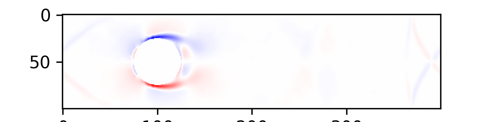
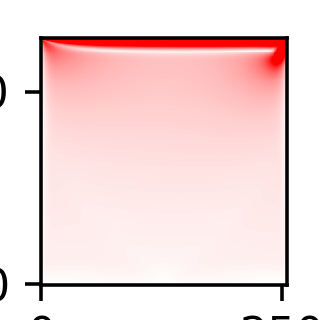
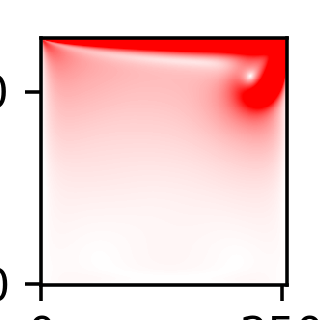

# Lattice Boltzmann Method Fluid Simulation

Classic computational fluid dynamic methods, instead working on NS-equation, assume fluid particles form a lattice structure.

## LBM_cylinder.py

This file runs the simulation in a given area that is setted in the code. 

The parameters of the fluid will be calculated and will be drawn on the figure and each "frame" will be paused for dt for obeservation.

!initial state (shape) can be changed in the code. Currently is a fluid with Kinematic viscosity of 1.48 * 1e-5 (kg/ms) and density of 1.225 (kg/m^2). The space is 400 x 100, with total time of 800 step. The fluid will be randomly generated in a given area.

Simulation result:

## LBM_cylinder_anime.py

This file will do excatly the same simulation as LBM_cylinder.py as above apart from this time the plotting will be saved as a mp4 file (video clip). 

## LBM_Cavity.py

This file will record the simulation result as LBM_cylinder_anime.py. This time, there will be a cylinder obstacle in the middle of the space. 

At beginning:

Simulation result:

